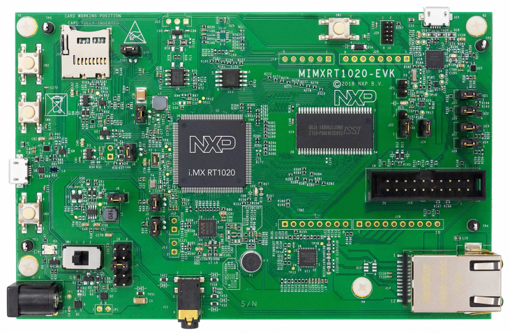
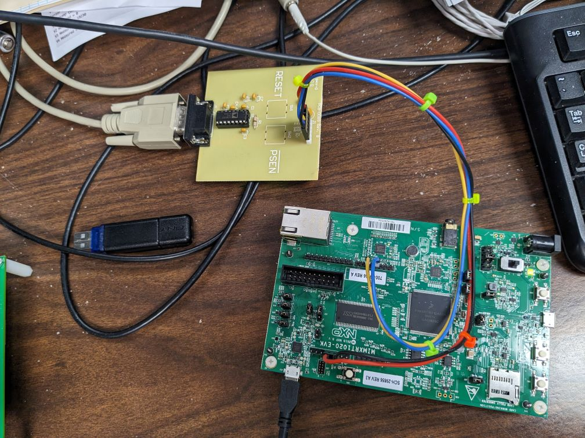

# Sensaphone Sentry Simulator


## Executive Summary
This project was developed <b>to become familiar with the NXP MCUXpresso IDE</b> and its utility in developing embedded software for NXP microcontrollers. The intent was to compare it to the STMicroelectronics STM32CubeIDE and its libraries and documentation for STM32 microprocessors, used in Temperature Display, 400 Cellular/Sentry, Temperature Sensor Display and future STM32-based Sentinel products.

Target device is an NXP MIMXRT1020-EVK evaluation board. Its processor is the MIMXRT1021DAG5A.



The chosen project is a 400 Cellular/Sentry simulator
- Inputs will be simulated
- Output will consist of an LED plus debug printouts
- Instead of a cellular transceiver, network connection will be via Ethernet port
- Ideally its debug inputs and outputs will be compatible with the Sensaphone 400 Cellular Diagnostic tool

As of 2023.12.01 <u>I much prefer STM32CubeIDE and STM32CubeProgrammer</u> over the IDEs from NXP and Silicon Labs (don't think they offer an equivalent to STM32CubeProgrammer; I use the IDE built-in debugger to program the respective devices).

## Getting the board up and running

After installing MCUXpresso IDE on my primary work PC, I built and installed the NXP example project 'evkmimxrt1020_iled_blinky' to blink an LED on the board. I also modified the frequency of the blink. This demonstrated successful installation of the MCUXpresso IDE and the ability to program the board.
- I connected the board to my PC with a provided USB cable. USB provided power and the interface to program and debug the board.

I soldered header pins into the Arduino headers on the board, and made a 4-wire cable to connect 3.3V, GND and serial TX/RX to the Sensaphone serial board PCB-0089 RevB. Building and installing NXP example projects 'evkmimxrt1020_hello_world', 'evkmimxrt1020_freertos_hello' and 'evkmimxrt1020_freertos_mutex' I verified at least the ability to read printouts from the board over a serial interface: got "Hello world" and other messages in a terminal.



I struggled with creating a FreeRTOS project from scratch. The skeleton project created with FreeRTOS enabled and selected had no hooks for any RTOS tasks, queues, semaphores nor any other RTOS constructs. I tried copying/pasting from the FreeRTOS examples, but that would only result in weird build failures (failures were in FreeRTOS, not being able to find its own functions!). Finally got a FreeRTOS project by copying an existing FreeRTOS example project. 
- In fact NXP documentation suggests that, to create a new project using some particular feature, to copy the relevant example project and edit it!

### Initial impressions
- Like the Silicon Labs Simplicity Studio IDE, MCUXpresso IDE makes example projects and demos more accessible than in STM32CubeIDE.
- Clock configuration appears comprehensive, though not graphical like STM32CubeIDE
- Adding/modifying FreeRTOS items like tasks, queues and semaphores/mutexes is done by copying/pasting or otherwise manually typing into code; it requires more FreeRTOS expertise. In contrast, STM32CubeIDE offers graphical selectors and other GUI items; it requires less FreeRTOS expertise. (I haven't tried Azure RTOS, and NXP provides no examples.)

### TODO things to add
- watchdog timer/timeout
- blink LED from Output task
- recognize/debounce button press via Input task, i.e. simulate Reset-To-Defaults button
- accept simple Diagnostic commands from the debug serial port
- read/write the QSPI flash chip, which also seems to be used for application storage; alternatively read/write the SD card for storage (but isn't that <em>file</em> storage?)
- access the Ethernet port via Network task for nonsecure connections (echo servers; NTP servers; ping Google)
- attempt secure connection with Sensaphone server

## Version history
### 2023.12.01 v0.0.1

First working project, derived from copying the NXP example project 'evkmimxrt1020_freertos_generic', slowly disabling code and rebuilding until a single FreeRTOS task remained while still able to build successfully. I renamed the single task as MainTask(). 

This still left the following FreeRTOS hook functions
- vApplicationTickHook()
- vApplicationMallocFailedHook()
- vApplicationStackOverflowHook()
- vApplicationIdleHook()

Of these I inserted an '*** ERROR ***' message into vApplicationMallocFailedHook() and vApplicationStackOverflowHook() but otherwise left them as is.

From the 'evkmimxrt1020_freertos_mutex' project I copied and pasted the mutex creation, take and give examples for the Diagnostic mutex. Next, adapted the LOG() debug macro from 400 Cellular, using the FreeRTOS semaphore take/give functions for the Diagnostic mutex. Tested the LOG() function in MainTask() and it worked.

Next, created 3 more tasks for Input, Output and Network. Each task also periodically printed a message.

Finally for this build, copied the PrintStartupBanner() routine and modified it to announce it as the Sensaphone Sentry Simulator. Since it required the version numbers, copied gconfig.h from 400 Cellular to the project source directory. I also had to add the PRODUCT_TYPE_SENSAPHONE_400_CELLULAR preprocessor #define into the project's preprocessor definitions
- project Properties > C/C++ Build > Settings > MCU C Compiler > Preprocessor

#### Demo debug output
``````
=================================<=>=================================
                    Sensaphone Sentry Simulator
                              v0.0.1.E
                             2023.12.01
=================================<=>=================================
MainTask: Sentry says, Hello world! Been here 1 times...
InputTask: Sentry says, InputTask here, been here 1 times...
OutputTask: Sentry says, OutputTask checking in! Been here 1 times...
NetworkTask: Sentry says, NetworkTask will be late to the party, been here 1 times...
MainTask: Sentry says, Hello world! Been here 2 times...
InputTask: Sentry says, InputTask here, been here 2 times...
MainTask: Sentry says, Hello world! Been here 3 times...
OutputTask: Sentry says, OutputTask checking in! Been here 2 times...
MainTask: Sentry says, Hello world! Been here 4 times...
InputTask: Sentry says, InputTask here, been here 3 times...
MainTask: Sentry says, Hello world! Been here 5 times...
NetworkTask: Sentry says, NetworkTask will be late to the party, been here 2 times...
MainTask: Sentry says, Hello world! Been here 6 times...
OutputTask: Sentry says, OutputTask checking in! Been here 3 times...
InputTask: Sentry says, InputTask here, been here 4 times...
MainTask: Sentry says, Hello world! Been here 7 times...
MainTask: Sentry says, Hello world! Been here 8 times...
InputTask: Sentry says, InputTask here, been here 5 times...
MainTask: Sentry says, Hello world! Been here 9 times...
OutputTask: Sentry says, OutputTask checking in! Been here 4 times...
MainTask: Sentry says, Hello world! Been here 10 times...
NetworkTask: Sentry says, NetworkTask will be late to the party, been here 3 times...
InputTask: Sentry says, InputTask here, been here 6 times...
MainTask: Sentry says, Hello world! Been here 11 times...
MainTask: Sentry says, Hello world! Been here 12 times...
OutputTask: Sentry says, OutputTask checking in! Been here 5 times...
InputTask: Sentry says, InputTask here, been here 7 times...
MainTask: Sentry says, Hello world! Been here 13 times...
MainTask: Sentry says, Hello world! Been here 14 times...
``````


